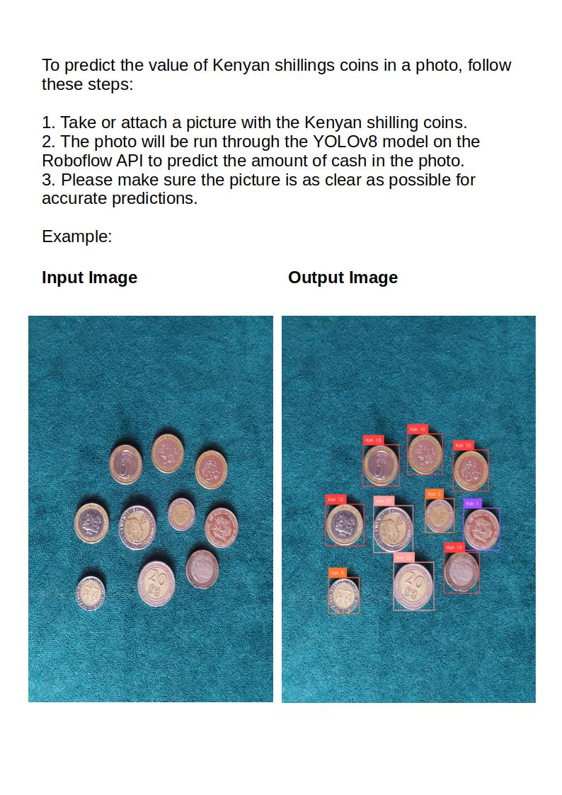

OpenVision
=============

OpenVision is a project that uses [Ultralytics](https://ultralytics.com) and [Roboflow Supervision](https://supervision.roboflow.com/latest/) inference for computer vision image dectection and classification using custom models.

What is OpenVisionBot?
--------------------
[@openvision_bot](https://t.me/openvisionrobo_bot)  is a telegram bot. This bot is a small project built on the YOLOv8 model with Ultralytics for detecting Kenyan shillings coins.

Getting Started
---------------

To learn how to use the bot, simply type `/help` in this telegram chat window. Our bot will guide you through the basic commands and features.

Setup
-----

### Clone this repository:

    git clone https://github.com/stevalberts/openvision.git

### Install the required dependencies:

    pip install -r requirements.txt

### Run the bot using Python:

    python main.py

Usage
-----

Type `/help` to learn more about how to use OpenVisionBot.

Closing
-------

To close this chat window, simply type `/quit`. The bot will bid you farewell and terminate the conversation.

Additional Resources
-------------------

For more information about the technology behind OpenVisionBot, visit:

* [Ultralytics website](https://ultralytics.com)
* [GitHub repository](https://github.com/stevalberts/openvision/tree/master)

About This Project
------------------

OpenVisionBot is a proof-of-concept project designed to demonstrate the capabilities of YOLOv8 model with Ultralytics in detecting Kenyan shillings coins. We hope you find this bot useful and enjoy using it!

If you have any questions or feedback, feel free to reach out to us!